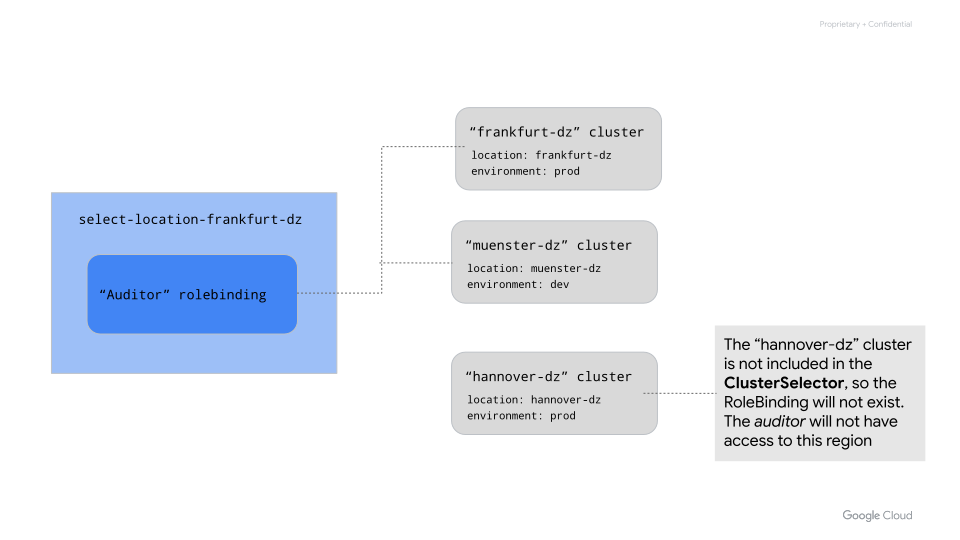

# Locality Specific Policy

This example exhibits how to configure policy that applies only to resources in specific regions.
We will create a RoleBinding named `Auditor` that only applies to clusters within a prescribed region.



## Contents

* [Prerequisites](#prerequisites)
* [Config Overview](#config-overview)
* [Setup](#setup)
  * [Fork and Clone this Repo](#fork-and-clone-this-repo)
  * [Configure ACM Operator](#configure-acm-operator-with-locality_specific_policy)
  * [Update Cluster Configs](#update-cluster-configs)
* [Define Policy as Config](#define-policy-as-config)
* [Observe Enforcement Across Clusters](#observe-enforcement-across-clusters)

### Prerequisites

* Install the [Cloud SDK (gcloud CLI)](https://cloud.google.com/sdk/docs/quickstarts)
* Install [kubectl](https://kubernetes.io/docs/tasks/tools/install-kubectl/#download-as-part-of-the-google-cloud-sdk)
* Install the [nomos CLI](https://cloud.google.com/anthos-config-management/downloads) for managing ACM across clusters
* Create or select four [GKE Clusters](https://cloud.google.com/kubernetes-engine/docs/how-to/creating-a-cluster) with the [ACM Operator installed](https://cloud.google.com/anthos-config-management/docs/how-to/installing)
      * The configs in this repository assume the cluster names to be "frankfurt-dz", "muenster-dz" and "hannover-dz".

## Config Overview

This repository contains the following files.

```console
locality-specific-policy/
├── setup/ # configuration for each cluster's ACM Operator
│   ├── frankfurt-dz.config-management.yaml
│   ├── muenster-dz.config-management.yaml
│   └── hannover-dz.config-management.yaml
└── config-root/ # directory ACM monitors for policy
   ├── README.md
   ├── system/
   ├── namespaces/
   ├── cluster/ # cluster scoped objects
   │   ├──clusterrole.auditor.yaml  # uses location-frankfurt-dz selector
   |   └── clusterrolebinding.auditor.yaml
   └── clusterregistry/ # defines selectors and cluster labels
       ├── cluster.muenster-dz.yaml
       ├── cluster.frankfurt-dz.yaml
       ├── cluster.hannover-dz.yaml
       ├── clusterregistry.select-location-frankfurt-dz.yaml
       └── clusterregistry.select-prod.yaml
```

## Setup

This example assumes you have four clusters with ACM installed and with [read access](https://cloud.google.com/anthos-config-management/docs/how-to/installing#git-creds-secret)  to a fork of this repo.

To setup the clusters for this example you will need to:

* [Fork and clone this repo](#fork-and-clone-this-repo)
* [Sync each cluster's ACM operator with this directory](#sync-acm-operator-to-selecting-clusters).
* [Update all cluster configs with the names of your clusters.](#update-cluster-configs)

### Fork and clone this repo

1. Fork this repo to your account

1. In your terminal, clone this repo locally.

      ```console
      $ git clone https://github.com/<GITHUB_USERNAME>/csp-config-management.git
      $ cd csp-config-management/docs/
      ```

### Configure ACM Operator with locality-specific-policy/

Each cluster's ACM operator must be configured to point to the config-root in locality-specific-policy/.

The setup directory and cluster configs for this example assumed the names "frankfurt-dz", "muenster-dz" and "hannover-dz".

Each cluster has its own config in the [setup/] directory.

If you are not using default names of "frankfurt-dz", "muenster-dz" and "hannover-dz", update the cluster's names in the `spec.clusterName` field.

1. Update the files in [setup/](setup/) to include your cluster names and git username.
    For example, if your github username is `user@example.com`, change each YAML to include
    ```yaml
    git:
      syncRepo: git@github.com:user@example.com/csp-config-management.git
    ```

1. Sync the ACM Operator for both clusters by repeating the following steps for "frankfurt-dz", "muenster-dz" and "hannover-dz" clusters.

    ```console
    # Get kubeconfig credentials for your cluster
    $ gcloud container clusters get-credentials <cluster name> --zone <cluster zone>
    # Ensure kubectl is using correct context
    $ kubectl config get-context
    # Apply the configuration to your cluster
    $ kubectl apply -f setup/<cluster name>.config-management.yaml
    ```

1. Confirm the sync was successful with `nomos status`

    ```console
    $ nomos status
    Connecting to clusters...
    Context                                 Status           Last Synced Token
    -------                                 ------           -----------------
    frankfurt-dz-cluster-context            SYNCED           <some commit hash>
    muenster-dz-cluster-context             SYNCED           <some commit hash>
    hannover-dz-cluster-context             SYNCED           <some commit hash>
    ```

### Update Cluster Configs

`ClusterSelectors` are used to rollout policy to specific clusters.
For `ClusterSelectors` to work, clusters must be labeled with relevant metadata.

The `Cluster` configs are located in the [clusterregistry/](config-root/clusterregistry/) directory.

ACM uses the `metadata.name` field to determine where `ClusterSelectors` apply.

If you are not using default names of "frankfurt-dz", "muenster-dz" and "hannover-dz", update the cluster's names in the `metadata.name` field.  Then push your changes to git for them to be picked up by ACM.

First, ensure your cluster configs are valid.
```console
$ cd config-root/
$ nomos vet
# Commit and push changes to git
$ git add clusterregistry/
$ git commit -m "updated cluster configs to point to my clusters"
$ git push origin master
```


## Define Policy as Config

This config creates a `RoleBinding` named `auditor` that only applies to clusters that are labelled "frankfurt-dz".

### ClusterSelectors and Cluster Configs

You use `ClusterSelectors` to rollout policy to specific clusters.
`ClusterSelectors` limit which clusters a config applies to by checking the
cluster's labels. [Read more about ClusterSelectors here.](https://cloud.google.com/anthos-config-management/docs/how-to/clusterselectors)

`ClusterSelectors` must reference labels associated with a cluster.  You can specify these labels in a `Cluster` config.

`ClusterSelectors` and `Cluster` configs are stored in the [clusterregistry/](config-root/clusterregistry/) directory.

Each `Cluster` config has a label that defines environment and location.  The `ClusterSelector` "[select-location-frankfurt-dz](config-root/clusterregistry/clusterselector.select-location-frankfurt-dz.yaml)" applies configs with the "location: frankfurt-dz" label.

### ClusterRole and ClusterRoleBinding

`ClusterSelectors` are referenced in config to limit the clusters they are applied to.

The `ClusterRole` "[auditor](config-root/cluster/clusterrole.auditor.yaml)"  references "select-location-frankfurt-dz" in the `annotations.configmanagement.gke.io/cluster-selector` field.  The "auditor" role is created only in clusters with the "location: frankfurt-dz" label. This will also apply to the  `ClusterRoleBinding` "[auditors](config-root/cluster/clusterrolebinding.auditor.yaml)".

## Observe Enforcement Across Clusters

We are going to first verify that the "auditors" `ClusterRoleBinding` exists in
clusters with a "location: frankfurt-dz" label.

Repeat the following for both the "frankfurt-dz" and "muenster-dz" clusters.

1. Ensure your kubectl context is pointing to a frankfurt-dz cluster

      ```console
      # update local kubeconfig to correct cluster
      $ gcloud container clusters get-credentials <frankfurt-dz or muenster-dz cluster name> --zone <cluster zone>
      # ensure kubectl is using correct context
      $ kubectl config get-context
      ```

1. Get ClusterRoleBinding with `kubectl`

      ```bash
      $ kubectl get clusterrolebinding auditors
      NAME         AGE
      auditors     5m
      ```

Next, let's verify that the "auditors" `ClusterRoleBinding` doesn't exist in
clusters with different location labels. Repeat the following for the "hannover-dz" clusters.

1. Ensure your kubectl context is pointing to correct cluster

      ```console
      # update local kubeconfig to correct cluster
      $ gcloud container clusters get-credentials <hannover-dz cluster name> --zone <cluster zone>
      # ensure kubectl is using correct context
      $ kubectl config get-context
      ```

1. Get ClusterRoleBinding with `kubectl`

      ```console
      $ kubectl get clusterrolebinding auditors
        Error from server (NotFound): clusterrolebindings.rbac.authorization.k8s.io "auditors" not found
      ```

By leveraging `ClusterSelectors` with RBAC, we have successfully rolled out config selectively based on location.
